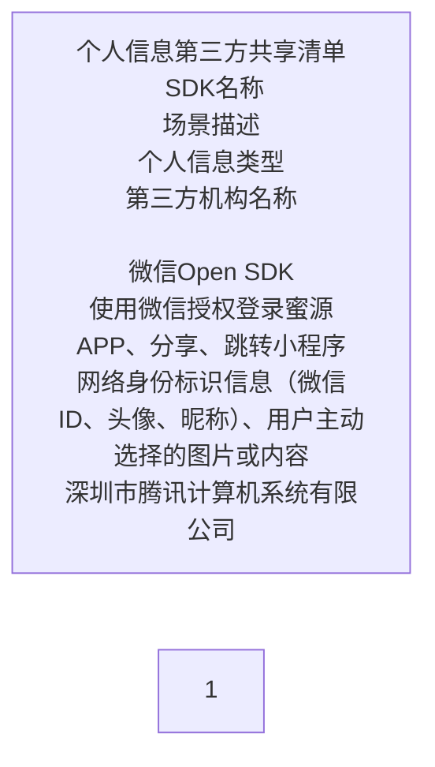

```mermaid
flowchart LR

id1["个人信息第三方共享清单<br> <th>SDK名称<br>场景描述<br>个人信息类型<br>第三方机构名称<br><br>微信Open SDK<br>使用微信授权登录蜜源APP、分享、跳转小程序<br>网络身份标识信息（微信ID、头像、昵称）、用户主动选择的图片或内容<br>深圳市腾讯计算机系统有限公司"]

id2["1"]
```